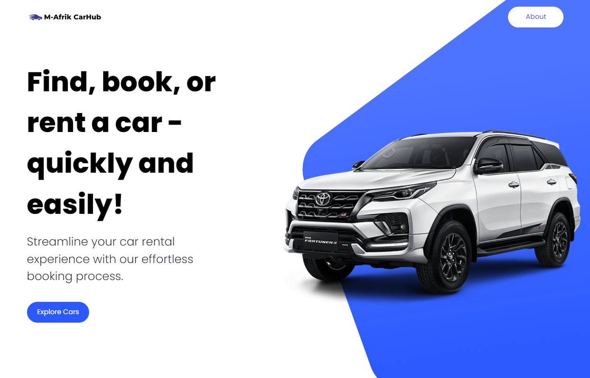

## M-Afrik Carhub

Built M-Afrik Carhub, a car listing website with Next.js 14 for enhanced performance and learning. It showcases diverse car types with detailed information, user-friendly design, and advanced filtering & pagination.

Open [M-Afrik Carhub](https://car-explorer-portal.vercel.app/) to access the production website.


## Screen Video


## 🛠 Tech Stack

- Next.js
- Tailwind CSS
- TypeScript


## ⚙️ Quick Start 
Follow these steps to set up the project locally on your machine.

Prerequisites

Make sure you have the following installed on your machine:

- [Git](https://git-scm.com/)
- [Node](https://nodejs.org/en)
- [npm (Node Package Manager)](https://www.npmjs.com/)

Cloning the Repository

```
git clone https://github.com/maxfortune93/car_explorer_portal.git

```

Installation

Install the project dependencies using npm:
```
npm install
```

Set Up Environment Variables

Create a new file named .env.local in the root of your project and add the following content:

```
NEXT_PUBLIC_RAPID_API_KEY=

NEXT_PUBLIC_IMAGIN_API_KEY=hrjavascript-mastery
```

Replace the placeholder values with your actual credentials. You can obtain these credentials by signing up on the corresponding websites from [Rapid](https://rapidapi.com/hub) API to [Imagin](https://www.imagin.studio/solutions/api) Cars

Running the Project

```bash
npm run dev
```

Open [http://localhost:3000](http://localhost:3000) with your browser to see the result.


In this project, I utilized [Headless](https://headlessui.com/) to create flexible and reusable interface components.

